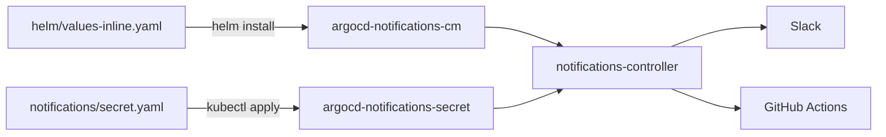
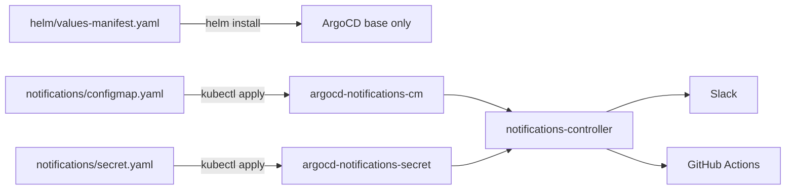
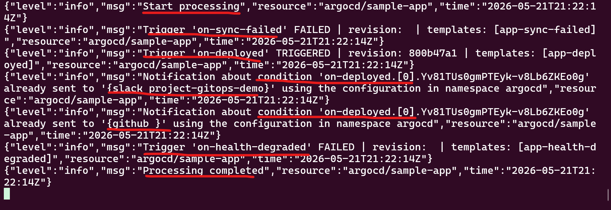
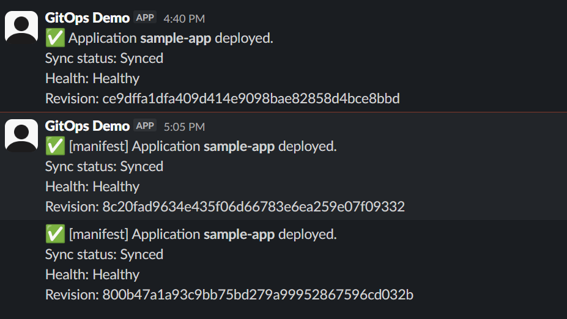
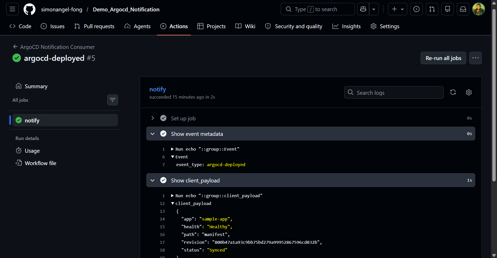

# Demo_Argocd_Notification

## Goal

Practice ArgoCD Notifications by wiring it up two ways (Helm-inline + standalone Kubernetes manifest) to two targets (Slack bot + GitHub Actions `repository_dispatch`). All four cells of the matrix were proven end-to-end on Docker Desktop Kubernetes.

|              | Slack | GitHub Actions |
| ------------ | ----- | -------------- |
| **Inline**   | ✅    | ✅             |
| **Manifest** | ✅    | ✅             |

Build sequence and gotchas: [docs/plan.md](docs/plan.md) · [docs/tech.md](docs/tech.md).

---

## Notification method: inline

Notifier / template / trigger config lives inside the Helm values file. One source of truth, applied via `helm install -f`.

### Architecture



### Key code

[helm/values-inline.yaml](helm/values-inline.yaml):

```yaml
notifications:
  enabled: true
  notifiers:
    service.slack: |
      token: $slack-token
    service.webhook.github: |
      url: https://api.github.com/repos/simonangel-fong/Demo_Argocd_Notification/dispatches
      headers:
      - { name: Authorization, value: token $github-token }
      - { name: Accept,        value: application/vnd.github+json }
  templates:
    template.app-deployed: |
      message: ":white_check_mark: Application *{{.app.metadata.name}}* deployed."
      webhook:
        github:
          method: POST
          body: |
            {"event_type":"argocd-deployed","client_payload":{"app":"{{.app.metadata.name}}","path":"inline"}}
  triggers:
    trigger.on-deployed: |
      - when: app.status.operationState != nil
            and app.status.operationState.phase in ['Succeeded']
            and app.status.health.status == 'Healthy'
        send: [app-deployed]
        oncePer: app.status.operationState.syncResult.revision
```

```sh
helm install argocd argo/argo-cd -n argocd --create-namespace \
  -f helm/values-inline.yaml
kubectl apply -f notifications/secret.yaml
```

---

## Notification method: manifest

Same notifier / template / trigger config, but as a standalone ConfigMap applied with `kubectl`. Helm only installs base ArgoCD; the notifications config is layered on top.

### Architecture



### Key code

[notifications/configmap.yaml](notifications/configmap.yaml):

```yaml
apiVersion: v1
kind: ConfigMap
metadata:
  name: argocd-notifications-cm
  namespace: argocd
data:
  service.slack: |
    token: $slack-token
  service.webhook.github: |
    url: https://api.github.com/repos/simonangel-fong/Demo_Argocd_Notification/dispatches
    headers:
    - { name: Authorization, value: token $github-token }
    - { name: Accept,        value: application/vnd.github+json }
  template.app-deployed: |
    message: ":white_check_mark: [manifest] Application *{{.app.metadata.name}}* deployed."
    webhook:
      github:
        method: POST
        body: |
          {"event_type":"argocd-deployed","client_payload":{"app":"{{.app.metadata.name}}","path":"manifest"}}
  trigger.on-deployed: |
    - when: app.status.operationState != nil
          and app.status.operationState.phase in ['Succeeded']
          and app.status.health.status == 'Healthy'
      send: [app-deployed]
      oncePer: app.status.operationState.syncResult.revision
```

```sh
helm install argocd argo/argo-cd -n argocd --create-namespace \
  -f helm/values-manifest.yaml
kubectl apply -f notifications/secret.yaml
kubectl apply -f notifications/configmap.yaml
```

---

## Inline vs Manifest

| Aspect          | Inline                           | Manifest                                                               |
| --------------- | -------------------------------- | ---------------------------------------------------------------------- |
| Source of truth | Single Helm values file          | Helm base + standalone ConfigMap                                       |
| Update workflow | `helm upgrade`                   | `kubectl apply`                                                        |
| Drift risk      | Low (one tool owns the CM)       | Moderate — Helm wants to revert the ConfigMap on upgrade               |
| Real-world fit  | Greenfield Helm-managed clusters | Multi-team setups where notifications are owned separately from ArgoCD |

---

## Key Captures

- ArgoCD log message:



- Slack message



- GitHub Actions run:


